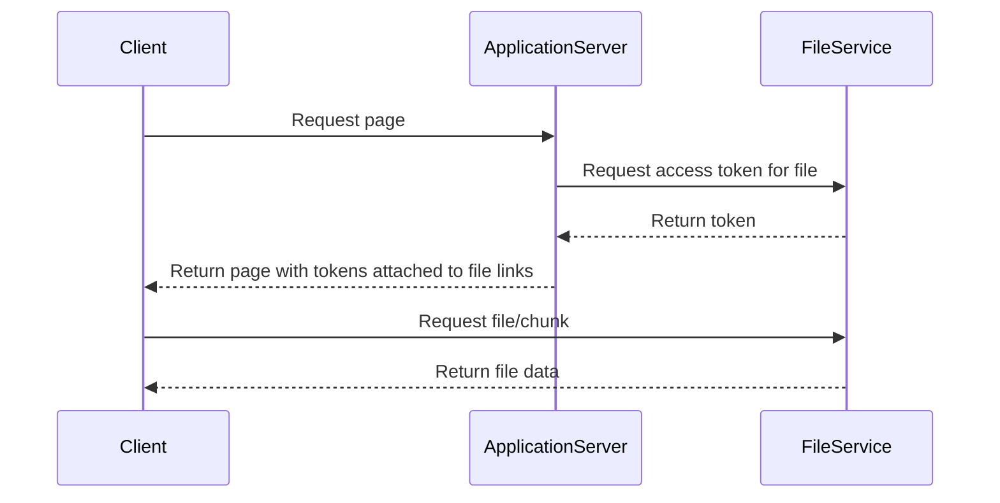

# Vid serve
This is a toy implementation of a file service designed to securely return video files to a client.

It is purely designed to demonstrate the approach requireing minimal extra processing when scrubbing through the video 
timeline and has not been tested in any capacity, nor is it production quality

## Request Flow

